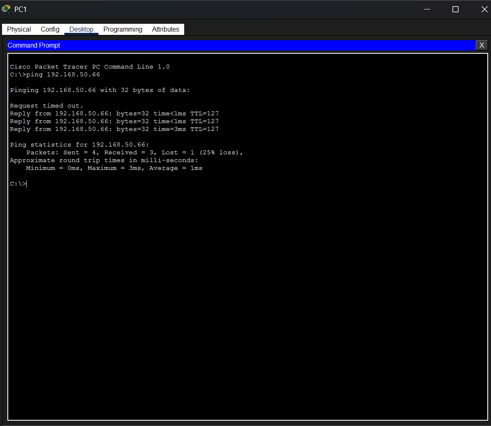

# 5-VLAN Inter-VLAN Routing Lab


---

## Overview

Enterprise networks require traffic isolation between departments for both security and performance. This lab designs and implements a fully segmented 5-VLAN enterprise network for a fictional company — separating Sales, HR, IT, Finance, and Management into isolated broadcast domains, all routed through a single router using the Router-on-a-Stick method.

The lab simulates a real-world enterprise environment and demonstrates core skills in network segmentation, IP addressing, trunking, and inter-VLAN routing using Cisco IOS.

---

## Network Topology


| Component | Details |
|-----------|---------|
| Router | Cisco 1941 |
| Switches | 2x Cisco 2960 |
| End Devices | 10 PCs (2 per VLAN) |
| VLANs | 5 |
| Routing Method | Router-on-a-Stick |

---

## VLAN Design

| VLAN ID | Department | Network | Gateway | Subnet Mask |
|---------|------------|---------|---------|-------------|
| 10 | Sales | 192.168.50.0/26 | 192.168.50.1 | 255.255.255.192 |
| 20 | HR | 192.168.50.64/26 | 192.168.50.65 | 255.255.255.192 |
| 30 | IT | 192.168.50.128/26 | 192.168.50.129 | 255.255.255.192 |
| 40 | Finance | 192.168.50.192/26 | 192.168.50.193 | 255.255.255.192 |
| 50 | Management | 192.168.51.0/26 | 192.168.51.1 | 255.255.255.192 |

Each VLAN uses a /26 subnet — providing 62 usable host addresses per department.

---

## Technologies Used

- Cisco Packet Tracer
- VLANs (Virtual Local Area Networks)
- Router-on-a-Stick (inter-VLAN routing)
- IEEE 802.1Q Trunking
- CIDR Subnetting (/26)
- Spanning Tree Protocol (STP)
- Cisco IOS CLI

---

## Configuration

### Router — Subinterface Configuration

Five subinterfaces were created on GigabitEthernet0/0, one per VLAN:

```bash
interface GigabitEthernet0/0
 no shutdown

interface GigabitEthernet0/0.10
 encapsulation dot1Q 10
 ip address 192.168.50.1 255.255.255.192

interface GigabitEthernet0/0.20
 encapsulation dot1Q 20
 ip address 192.168.50.65 255.255.255.192

interface GigabitEthernet0/0.30
 encapsulation dot1Q 30
 ip address 192.168.50.129 255.255.255.192

interface GigabitEthernet0/0.40
 encapsulation dot1Q 40
 ip address 192.168.50.193 255.255.255.192

interface GigabitEthernet0/0.50
 encapsulation dot1Q 50
 ip address 192.168.51.1 255.255.255.192
```

### Switch — VLAN and Trunk Configuration

```bash
! Create VLANs
vlan 10
 name Sales
vlan 20
 name HR
vlan 30
 name IT
vlan 40
 name Finance
vlan 50
 name Management

! Assign access ports to VLANs
interface FastEthernet0/1
 switchport mode access
 switchport access vlan 10

! Configure trunk port toward router
interface GigabitEthernet0/1
 switchport mode trunk
 switchport trunk allowed vlan 10,20,30,40,50
```

Full configurations for both switches and the router are available in the [`configs/`](configs/) folder.

---

## Verification

After configuration, connectivity between all VLANs was verified using ping tests across departments.



```bash
! Key verification commands used
show vlan brief
show interfaces trunk
show ip interface brief
show running-config
show spanning-tree
```

---

## Troubleshooting

Three issues were encountered and resolved during the lab:

### Issue 1 — Incorrect Interface Configuration Mode
**Problem:** Attempted to configure subinterface IP address while in the wrong config mode.  
**Resolution:** Used `interface GigabitEthernet0/0.10` to enter subinterface config mode before assigning the IP address.

### Issue 2 — Trunk Port Not Forwarding Traffic
**Problem:** Inter-VLAN traffic was being dropped between switches.  
**Root Cause:** Trunk port on Switch0 Fa0/1 was still configured as access mode.  
**Resolution:** Verified using `show interfaces trunk` — confirmed port was not trunking. Reconfigured with `switchport mode trunk` and specified allowed VLANs.

### Issue 3 — Spanning Tree Protocol Blocking Traffic
**Problem:** One trunk link between switches was not forwarding traffic despite correct configuration.  
**Root Cause:** STP had placed the port in a blocking state (BLK) due to a topology loop detection.  
**Resolution:** Used `show spanning-tree` to identify the blocked port. Verified the STP root bridge election and confirmed the correct port was in forwarding state after STP reconverged.

---

## Security Relevance

VLAN segmentation is a foundational network security control. This lab demonstrates how it works in practice:

- **Broadcast domain isolation** — traffic in VLAN 10 (Sales) is invisible to VLAN 40 (Finance), reducing the attack surface
- **Lateral movement prevention** — a compromised device in Sales cannot directly communicate with Finance systems without passing through the router, where access control policies can be applied
- **Privilege separation** — Management (VLAN 50) is isolated from all other departments, protecting administrative access
- **Defence in depth** — VLAN segmentation is the first layer of network-level security, combined with ACLs and firewall rules in a full enterprise deployment

This design maps to the **network segmentation** control recommended in NIST SP 800-53 (SC-7) and ISO 27001 Annex A.13.

---

## Project Structure

```
5-VLAN-Inter-VLAN-Routing-Lab/
│
├── README.md                    # This file
├── AlexOjo-5Vlan-Lab.pkt        # Cisco Packet Tracer file
│
├── configs/
│   ├── router-config.txt        # Full router running config
│   ├── switch0-config.txt       # Switch 0 running config
│   └── switch1-config.txt       # Switch 1 running config
│
├── screenshots/
│   ├── topology.png             # Network topology diagram
│   ├── ping-test.png            # Successful inter-VLAN ping results
│   ├── router-config.png        # Router subinterface configuration
│   ├── switch0-vlan.png         # Switch 0 VLAN table
│   └── switch1-vlan.png         # Switch 1 VLAN table
│
└── docs/
    ├── subnetting-table.md      # IP addressing and subnetting breakdown
    └── troubleshooting.md       # Detailed troubleshooting log
```

---

## Skills Demonstrated

| Skill | Details |
|-------|---------|
| Network Segmentation | Designed 5-VLAN topology for department isolation |
| IP Addressing & Subnetting | Applied /26 CIDR subnetting across 5 VLANs |
| Router-on-a-Stick | Configured subinterfaces with 802.1Q encapsulation |
| IEEE 802.1Q Trunking | Configured and verified trunk links between switches and router |
| STP Troubleshooting | Identified and resolved STP port blocking issues |
| Cisco IOS CLI | Configured router and switches using full Cisco IOS command set |
| Network Security | Applied VLAN segmentation as a security control |
| Documentation | Produced structured lab documentation and troubleshooting log |

---

## Author

**Alex Ojo** — Cybersecurity Student | Networking Enthusiast  
🔗 [GitHub](https://github.com/alexojocyber) | [LinkedIn](https://www.linkedin.com/in/alex-ojo-ab9252185) | [Portfolio](https://alexojocyber.github.io)
